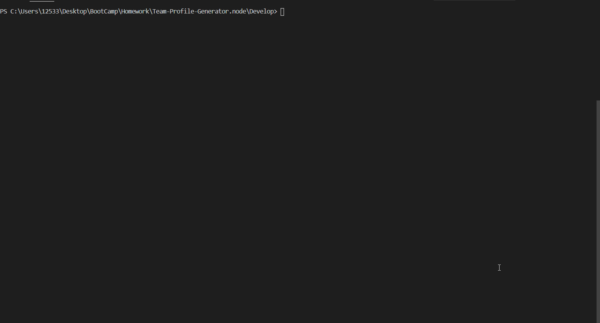

# Template Engine - Employee Summary - OOP

One of the most important aspects of programming is writing code that is readable, reliable, and maintainable. Oftentimes, *how* we design our code is just as important as the code itself. In this homework assignment, your challenge is to build a Node CLI that takes in information about employees and generates an HTML webpage that displays summaries for each person. Since testing is a key piece in making code maintainable, you will also be ensuring that all unit tests pass.


## Design

A software engineer team generator command line application that prompts the user for information about the team manager and then information about the team members. The user can input any number of team members, and they may be a mix of different roles within the company. When the user has completed building the team, the application will create an HTML file that displays a nicely formatted team roster based on the information provided by the user.

```
As a manager
I want to generate a webpage that displays my team's basic info
so that I have quick access to emails and GitHub profiles
```

This project was completed by using node libraries such as inquirer, path, and fs, all based off object-orientated programming (OOP) methods.
* Inquirer is used for the backend CLI application that the user is able to interact with to generate the team.

* Path is used to make all relative paths direct, in relation to the user and all files associated with the program.

* Fs is used to direct all data inserted by user to send to correct HTML file to transcribe all information into the correct place as desired.


In the `Develop` folder, there is a `package.json`, so make sure to `npm install`.

Other instances used in this application are Bootstrap, Font Awesome, and jQuery, to help power the application and give a friendly UI/UX touch!

Tests are also created and able to be used at any time to assure that the correct classes are always being built and deployed.

1. Run tests
2. Create or update classes to pass a single test case
3. Repeat

🎗 Remember, as a user, you can run the tests at any time with `npm run test`

Backend functionality...




## Questions
​
If you have any questions about the repo, please contact me:

On GitHub: [adam-birgenheier](https://github.com/abirgenheier) | Via Email: AdamCarlBirgenheier@gmail.com

